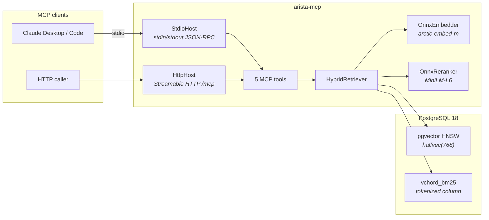
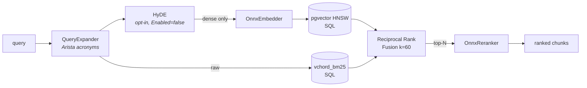

# arista-mcp

Hybrid retrieval MCP server for Arista documentation.

[](https://dotnet.microsoft.com/)
[](https://www.postgresql.org/)
[](https://github.com/pgvector/pgvector)
[](https://onnxruntime.ai/)
[](https://modelcontextprotocol.io/)
[](#license)

**[English docs](docs/en/) · [Документация на русском](docs/ru/) · [Changelog](CHANGELOG.md)**

---

`arista-mcp` consumes the catalog produced by [`arista-docs`](https://github.com/dantte-lp/arista-docs)
(Markdown + per-document JSON) and serves it to Claude or any MCP client via
five tools — `search_docs`, `lookup_section`, `list_documents`, `get_document`,
`get_status`. Runs over stdio (Claude Desktop / Claude Code) or Streamable HTTP.

Retrieval is a three-stage pipeline: **dense** (`snowflake-arctic-embed-m-v1.5`
through ONNX Runtime, `halfvec(768)`, HNSW `halfvec_cosine_ops`) and **sparse**
(`vchord_bm25` with a custom-model tokenizer) run in parallel, fuse via
**Reciprocal Rank Fusion** at k = 60, then the top-N are **reranked** by a
BERT cross-encoder (`ms-marco-MiniLM-L6-v2`). Queries get Arista acronym
annotations before embedding.

## Architecture at a glance



See **[docs/en/architecture.md](docs/en/architecture.md)** for layering rules
and detailed component / sequence diagrams.

## Retrieval pipeline



Deep dive in **[docs/en/retrieval.md](docs/en/retrieval.md)**.

## Quick start

```bash
# 1. PostgreSQL 18 with pgvector + vchord + vchord_bm25 + pg_tokenizer
podman compose -f docker/compose.yaml up -d postgres

# 2. ONNX models (~530 MB) + optional HyDE LLM (~1 GB Qwen2.5 GGUF)
pwsh scripts/fetch-models.ps1

# 3. Schema: documents, chunks, ingest_runs, bm25v trigger, HNSW + BM25 indexes
dotnet ef database update --project src/AristaMcp.Data --startup-project src/AristaMcp.Data

# 4. Ingest the arista-docs catalog (or a slice)
dotnet run --project src/AristaMcp.Cli -- ingest
dotnet run --project src/AristaMcp.Cli -- ingest --category avd  # ~2 min test slice

# 5. Serve — stdio for Claude Desktop / Claude Code
dotnet run --project src/AristaMcp.Cli -- serve --transport stdio

#    ...or HTTP for local experiments
dotnet run --project src/AristaMcp.Cli -- serve --transport http --port 8080
```

Walk-through, troubleshooting, client configs →
**[docs/en/getting-started.md](docs/en/getting-started.md)**.

## MCP tools

| Tool              | Purpose                                                          |
|-------------------|------------------------------------------------------------------|
| `search_docs`     | Hybrid search — returns ranked chunks + optional diagnostics     |
| `lookup_section`  | Full text of a named section across its chunks                   |
| `list_documents`  | Filter documents by category / product                           |
| `get_document`    | Full metadata + chunk count for one document                     |
| `get_status`      | Chunk / document counts and last ingest-run summary              |

Full schemas, example payloads, query patterns → **[docs/en/mcp-tools.md](docs/en/mcp-tools.md)**.

## CLI verbs

| Verb                      | Purpose                                                                 |
|---------------------------|-------------------------------------------------------------------------|
| `arista-mcp ingest`       | Chunk + embed + upsert an `arista-docs` catalog into PostgreSQL         |
| `arista-mcp serve`        | Run the MCP server (`--transport stdio\|http`, `--port N`)              |
| `arista-mcp bench`        | Retrieval bench with per-run JSONL history (`--history`, `--label`)     |
| `arista-mcp curate-triples`       | Emit `(query, positive, hard-negatives)` for cross-encoder tuning |
| `arista-mcp validate-bench-queries` | Fairness-filter LLM-generated bench queries via the retriever   |

## Documentation

| Doc                                                      | Audience               |
|----------------------------------------------------------|------------------------|
| [docs/en/architecture.md](docs/en/architecture.md)       | Component / layer map  |
| [docs/en/retrieval.md](docs/en/retrieval.md)             | How hybrid search works end-to-end |
| [docs/en/getting-started.md](docs/en/getting-started.md) | Hands-on setup         |
| [docs/en/mcp-tools.md](docs/en/mcp-tools.md)             | Tool reference         |
| [docs/en/benchmarking.md](docs/en/benchmarking.md)       | Bench v2 methodology   |
| [docs/en/development.md](docs/en/development.md)         | Build, test, conventions |

Russian translation: **[`docs/ru/`](docs/ru/)**.

Historical / operational notes: [`docs/mcp-integration.md`](docs/mcp-integration.md),
[`docs/onnx-provider.md`](docs/onnx-provider.md), [`docs/otel.md`](docs/otel.md).

## Current status

- **v0.1.4** shipped — stock MiniLM reranker, 111-query bench.
- **v0.3.0 in progress** — expanded 588-query chunk-ID bench (`bench-queries-v2.json`),
  top-1 stock baseline 90.82 %, target 95 %.
- Plan: [`docs/superpowers/plans/2026-04-24-arista-mcp-retrieval-quality-v0.3-revised.md`](docs/superpowers/plans/2026-04-24-arista-mcp-retrieval-quality-v0.3-revised.md).
- See [CHANGELOG.md](CHANGELOG.md) for the full version history.

## License

TBD.
