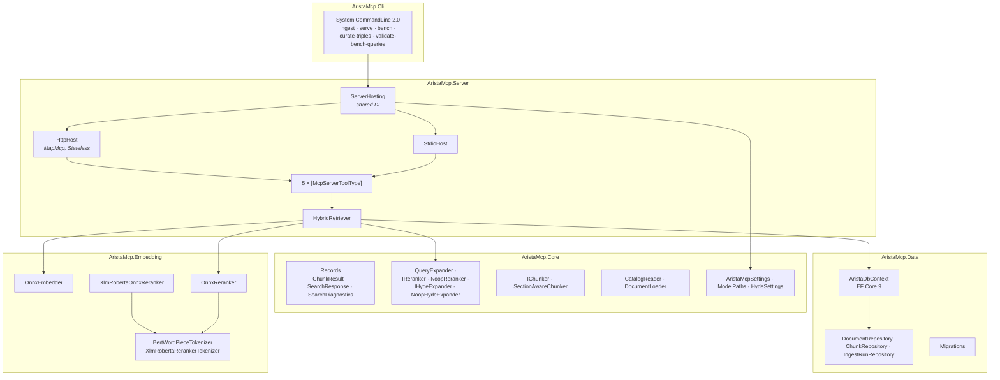
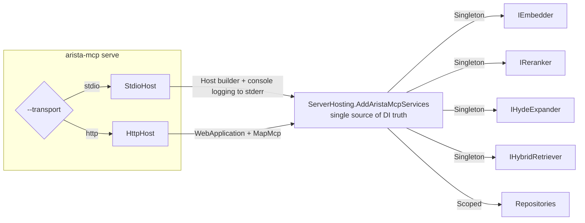
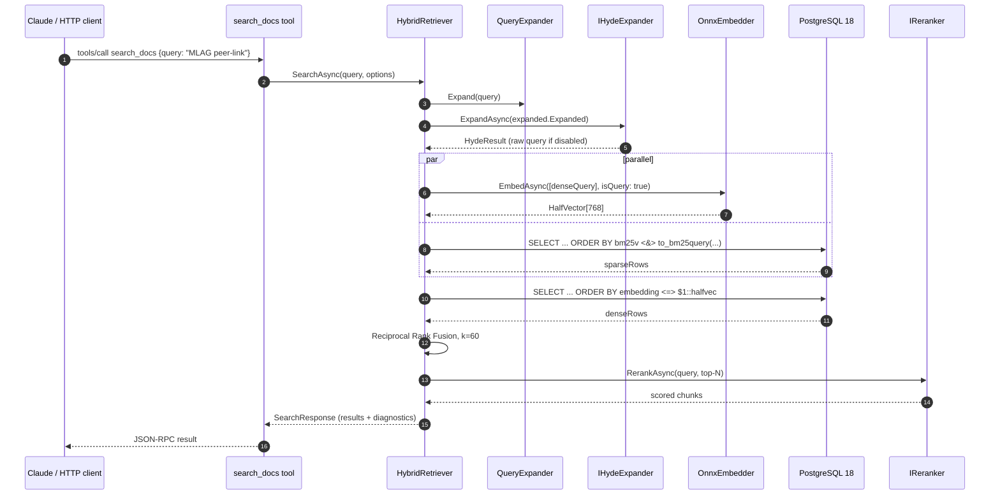
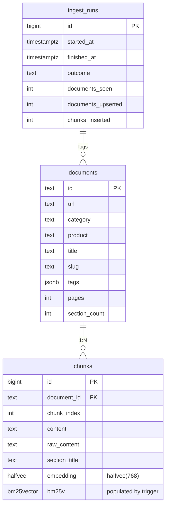

# Architecture

`arista-mcp` is a layered .NET 10 application with a deliberately small
surface area: one solution, six projects, one database, two MCP transports.

## Layer map



### Strict dependency rule

```
Cli → Server → Core ← Embedding, Data
```

Core has **no reference** to `Data`, `Embedding` or `Server`. Tests may reference
any layer. The rule is enforced by project files, not just convention.

### Why the split matters

- Core owns the domain vocabulary (records, settings) and the
  framework-free algorithms (query expansion, chunking, retrieval
  contracts). Swap any downstream project without editing domain code.
- Embedding is isolated so the ONNX Runtime dependency (and optionally
  the CUDA runtime) stays out of the rest of the build graph. The
  `-p:UseGpuOnnx=true` build switch picks the GPU package *only* in
  this project.
- Data holds every SQL / EF Core detail. `HybridRetriever` lives in
  Server because it issues raw Npgsql — Core couldn't without pulling
  Npgsql into every consumer.

## Hosting — two transports, one DI graph



Keeping the two hosts on a shared DI method means a bug fix in wiring
never lands in only one of the transports.

## Runtime sequence — a typical `search_docs` call



Dense embedding and sparse SQL run in parallel via `Task.WhenAll`. RRF fusion
and rerank are cheap enough to stay on the main task.

## Data layer — schema sketch



- `embedding` uses pgvector `halfvec(768)` — half the size of `vector(768)`
  at negligible recall cost. HNSW index with `halfvec_cosine_ops`.
- `bm25v` is populated by a postgres trigger from `tokenizer_catalog
  .create_custom_model_tokenizer_and_trigger` — you don't write to it
  directly.

## Tech stack version pins

As of v0.1.4, from `Directory.Packages.props`:

| Package                                 | Version  |
|-----------------------------------------|----------|
| .NET SDK                                | 10.0.201 |
| ModelContextProtocol                    | 1.2.0    |
| EF Core + Npgsql.EFCore + Pgvector.EFCore | 9.0.15 / 9.0.4 / 0.3.0 (held for Pgvector compat) |
| Microsoft.ML.OnnxRuntime                | 1.24.4   |
| Microsoft.ML.Tokenizers                 | 2.0.0    |
| System.CommandLine                      | 2.0.6    |
| PostgreSQL                              | 18 (tensorchord/vchord-suite image) |
| pgvector / vchord / vchord_bm25 / pg_tokenizer | 0.8.2 / 1.1.1 / 0.3.0 / 0.1.1 |

## Next

- [retrieval.md](retrieval.md) — every stage of the search pipeline in detail.
- [getting-started.md](getting-started.md) — bring the stack up.
- [../CLAUDE.md](../../CLAUDE.md) — operational gotchas per sprint.
