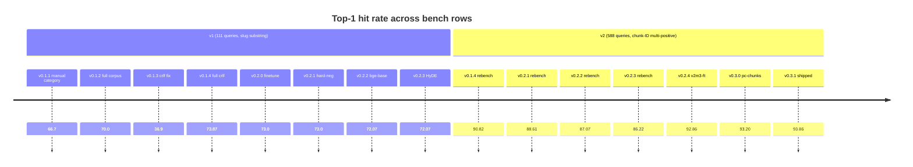
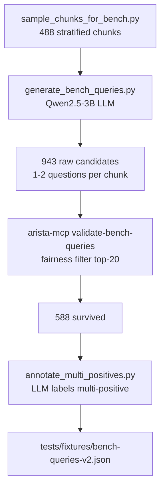

# Benchmarking

The project ships two bench sets and an append-only history so
retrieval-quality deltas are visible across time.

## Bench-history at a glance

`tests/fixtures/bench-history.jsonl` is the long-running log. One row
per `arista-mcp bench … --history --label` invocation.



The v0.3.1 row is the shipped baseline: 570-q v2 fixture, bge-m3 dense
+ vchord_bm25 sparse + RRF (k=60) + `bge-reranker-v2-m3` INT8
fine-tune. Parent-child leaf filtering on; multi-query expansion and
listwise LLM re-rank off (both regressed on the v2 bench and kept
behind flags).

## Two bench versions, one harness

### v1 — 111 queries, slug substring scoring

`tests/fixtures/bench-queries.json`. Curated by hand across the catalog's
product distribution. Each query carries:

- `expect_any: [string]` — substring tokens matched against document
  `slug` and `title`.
- `expect_product: string?` — optional exact match on `ChunkResult.Product`
  for products like `hardware` that use model-number slugs.

A query is a **hit** if any returned result matches either rule.

**Known issue.** The substring heuristic systematically under-counts
when the reranker picks a *valid but differently-slugged* chunk as
rank 0. Stock MiniLM consistently landed at top-1 72–74 % on v1 across
five unrelated experiments (stock, fine-tune, bge-base, HyDE), with
the entire ±1.8 pp variance attributable to two queries flipping
between rank 1 and rank 2–10. At n=111, σ = ±4.2 pp — below the
measurement floor for a +2 pp uplift.

### v2 — 588 queries, chunk-ID multi-positive scoring

`tests/fixtures/bench-queries-v2.json`. Generated by the Sprint 13
pipeline:



Each query carries:

```jsonc
{
  "query": "what is the minimum TPM version required for compatibility?",
  "source_chunk_id": 75099,
  "expect_any_of_chunk_ids": [75099, 131398],
  "product": "eos",
  "source_doc_title": "...",
  "source_section_title": "...",
  "generation_model": "qwen2.5-3b-instruct"
}
```

A query is a **hit** if any returned result's `chunkId` is in
`expect_any_of_chunk_ids`. The v1 `expect_any` / `expect_product`
heuristics are ignored when `expect_any_of_chunk_ids` is populated.

**Positive distribution:**

| Positives per query | Queries | % of set |
|---------------------|---------|----------|
| 1                   | 204     | 35 %     |
| 2                   | 184     | 31 %     |
| 3                   | 98      | 17 %     |
| 4–6                 | 70      | 12 %     |
| 7–10                | 32      | 5 %      |

65 % of queries have more than one valid chunk — this is what v1
substring scoring was flattening.

**Statistical power:** σ ≈ 1.3 pp at n=588 and p ≈ 0.9. A real +3 pp
uplift is detectable at ~95 % confidence, well above the v1 ±4.2 pp
floor.

## Running a bench

```bash
# v2 default (recommended for new experiments)
dotnet run --project src/AristaMcp.Cli -- bench \
  --queries tests/fixtures/bench-queries-v2.json \
  --limit 10 \
  --history tests/fixtures/bench-history.jsonl \
  --label my-experiment

# v1 for historical comparison
dotnet run --project src/AristaMcp.Cli -- bench \
  --queries tests/fixtures/bench-queries.json \
  --limit 10 \
  --history tests/fixtures/bench-history.jsonl \
  --label my-experiment-v1
```

The harness picks the scoring rule from `bench_queries.version` in the
input file. v2 rows get `query_set_version: 2` stamped into the history
row so v1 and v2 don't get mixed up later.

## Interpreting a row

```json
{
  "date": "2026-04-24T00:32:17.123Z",
  "label": "v0.1.4-rebench-v2",
  "query_set_version": 2,
  "query_count": 588,
  "top_k": 10,
  "top1_hit_rate": 90.82,
  "topk_hit_rate": 100.0,
  "latency_p50_ms": 550.2,
  "latency_p95_ms": 818.8,
  "latency_avg_ms": 560.3
}
```

- `top1_hit_rate` — what % of queries put a valid chunk at rank 0.
  This is the primary quality signal for a reranker.
- `topk_hit_rate` — % with a valid chunk anywhere in top-K. Measures
  **retrieval** (dense + BM25 + RRF). v2 nearly always = 100 because
  the fairness filter dropped queries the retriever couldn't find.
- `latency_p*_ms` — end-to-end `SearchAsync`. On CPU-only stock MiniLM
  on a 12-core host: p50 ~550 ms, p95 ~820 ms on v2 (588 queries).

## Expanding the bench (regenerate v2)

The pipeline scripts live in the sibling
[`arista-reranker-tune`](../../../../arista-reranker-tune) repo
(submodule-style, not versioned here).

```bash
# From C:/SHARE/arista-reranker-tune (WSL2 Ubuntu with uv)

# 1. Sample chunks from postgres
uv run python scripts/sample_chunks_for_bench.py \
  --out data/bench-seed-chunks.jsonl --target 500

# 2. Bring up llama.cpp sidecar with Qwen2.5-3B
podman compose -f ../arista-mcp/docker/compose.yaml --profile llm up -d

# 3. LLM-generate queries (~45 min for 500 chunks on CPU)
uv run python scripts/generate_bench_queries.py \
  --in data/bench-seed-chunks.jsonl \
  --out data/bench-queries-raw.jsonl --resume

# 4. Fairness filter via current retriever (~12 min)
cd ../arista-mcp
dotnet run --project src/AristaMcp.Cli -- validate-bench-queries \
  --input ../arista-reranker-tune/data/bench-queries-raw.jsonl \
  --output ../arista-reranker-tune/data/bench-queries-validated.jsonl \
  --top-k 20

# 5. Multi-positive annotation (~3 h on CPU)
cd ../arista-reranker-tune
uv run python scripts/annotate_multi_positives.py \
  --in data/bench-queries-validated.jsonl \
  --out ../arista-mcp/tests/fixtures/bench-queries-v2.json
```

## Reading bench rows for real decisions

- **Below σ = noise.** Don't chase +1 pp differences on v2 — they're
  within the measurement floor.
- **Compare to `*-rebench-v2` baselines**, not to v1 rows. v1 rows are
  historical under-counts and should never be benchmarked against v2.
- **Latency regressions are reliably measurable**, unlike sub-σ
  quality deltas. A bench that gains 0.5 pp top-1 but doubles p95 is
  not a win.
- **Look at top-10.** If top-10 drops while top-1 rises, something in
  the retrieval path regressed to compensate for a reranker gain —
  investigate before promoting.
