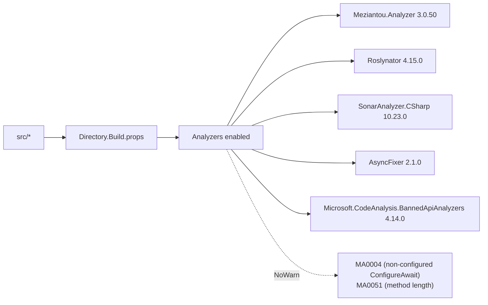

# Development

Build, test, contribute.

## Build

```bash
dotnet build                   # Debug, all projects, all analyzers active
dotnet build -c Release        # Release
dotnet build -p:UseGpuOnnx=true   # Swap CPU → GPU ONNX Runtime
```

Solution is defined in `arista-mcp.slnx`. Central package management
lives in `Directory.Packages.props` — **add versions there, not in
project files**.

`global.json` pins the SDK to 10.0.301.

## Test

```bash
dotnet test                    # full suite: unit + integration + E2E
dotnet test --filter "FullyQualifiedName~HyDE"   # narrow filter
dotnet test tests/AristaMcp.Embedding.Tests/     # single project
```

Integration + E2E tests require:

- Podman postgres running (`podman compose up -d postgres`).
- `PgvectorFixture` connects to the `arista_test` DB and refuses anything
  else by suffix guard; override via `ARISTA_MCP_TEST_CS`.

SkippableFacts guard tests that need model files or an ingested corpus —
they skip cleanly on a bare checkout.

## Run locally

```bash
dotnet run --project src/AristaMcp.Cli -- serve --transport stdio
dotnet run --project src/AristaMcp.Cli -- serve --transport http --port 8080
dotnet run --project src/AristaMcp.Cli -- bench --queries tests/fixtures/bench-queries-v2.json
dotnet run --project src/AristaMcp.Cli -- ingest --catalog ../arista-docs/catalog.json
```

## Code style + analyzers



Repo-wide rules:

- **One type per file** (MA0048). Split records + classes + enums into
  separate files even when closely related.
- **Avoid `DateTimeOffset.UtcNow`** in new code — inject `TimeProvider`
  from DI. Production registers `TimeProvider.System`; tests use
  `FakeTimeProvider` from `Microsoft.Extensions.TimeProvider.Testing`.
- **No `.ConfigureAwait(false)` suppressions** (MA0004 globally
  suppressed for console/ASP.NET Core contexts).
- **No `Select + ToArray`-style allocations in hot paths**;
  `CollectionsMarshal`, `TensorPrimitives`, and collection expressions
  are preferred — see `HybridRetriever.ReciprocalRankFusion`.
- **Sealed by default** — entity + repository classes are sealed.
- **Banned APIs** (`BannedSymbols.txt`) — don't add unless discussed.

Tests get an extra relaxation via `tests/Directory.Build.props`:

- `CA1707` (underscore names) — snake_case test method names are fine.
- `CA1711` (xUnit `*Collection` naming) — `[Collection]` attribute requires it.
- `MA0004`, `MA0051` — test bodies are long and don't need `ConfigureAwait`.

## Layering rule — enforced, not cosmetic

```
Cli → Server → Core ← Embedding, Data
```

- `AristaMcp.Core` has **no references** to Data, Embedding, or Server.
  Project files enforce this — if you try to add one, `dotnet build`
  fails.
- Tests may reference any layer.

Why: Core hosts domain records + algorithmic interfaces. The moment it
references Npgsql or ONNX, every downstream consumer inherits those
binaries. Keeping the core dep-light is a one-way door — easy to lose,
hard to claw back.

## Adding a new MCP tool

1. Create `src/AristaMcp.Server/Tools/MyTool.cs` with
   `[McpServerToolType]` class attribute and `[McpServerTool(Name =
   "my_tool")]` on the public method.
2. Declare the method signature — inputs are parameters, output is
   returned directly (JSON-serialised by the SDK).
3. Inject any DI services via the constructor.
4. Register via the existing scanner — `ServerHosting` picks tools up
   automatically.
5. Write at least one integration test in `tests/AristaMcp.Server.Tests/`.
6. Document in [`mcp-tools.md`](mcp-tools.md).

## Adding a new CLI verb

1. New class `src/AristaMcp.Cli/Commands/MyCommand.cs` with a static
   `Build()` returning `System.CommandLine.Command`.
2. Wire options with `Option<T>`, set `Required = true` where
   appropriate.
3. `cmd.SetAction(async (ParseResult pr, CancellationToken ct) => …)`.
4. Register in `src/AristaMcp.Cli/Program.cs`.
5. Update the README verb table + this page if user-facing.

## Database migrations

```bash
cd src/AristaMcp.Data
dotnet ef migrations add MyChange --startup-project .
dotnet ef database update --startup-project .
```

The `Migrations/` folder has its own `.editorconfig` disabling analyzers
on EF-generated code — don't hand-edit `Designer.cs` files.

## Observability hooks

When you introduce a new retrieval or ingest stage that's worth tracing,
add a span under the existing `ActivitySource "AristaMcp"`:

```csharp
using var span = AristaActivity.Source.StartActivity(AristaActivity.Operations.MyStage);
span?.SetTag(AristaActivity.Tags.SomeTag, value);
```

Operation + tag names are constants under
`src/AristaMcp.Core/Observability/AristaActivity.cs`. The source name
itself (`AristaMcp`) is a stable contract for downstream dashboards —
don't rename it.

## Contributing workflow

1. Skim `CLAUDE.md` and the relevant sprint plan under
   `docs/superpowers/plans/` before starting a non-trivial change.
2. Branch from `master`. One logical change per commit.
3. `dotnet build` + `dotnet test` must be green before pushing.
4. Update [`CHANGELOG.md`](../../CHANGELOG.md) `[Unreleased]` section with
   user-visible changes (format: Keep a Changelog 1.1.0).
5. If you touched retrieval quality, run `bench --history --label
   my-change-vN` against v2 and include the row-diff in the PR body.
