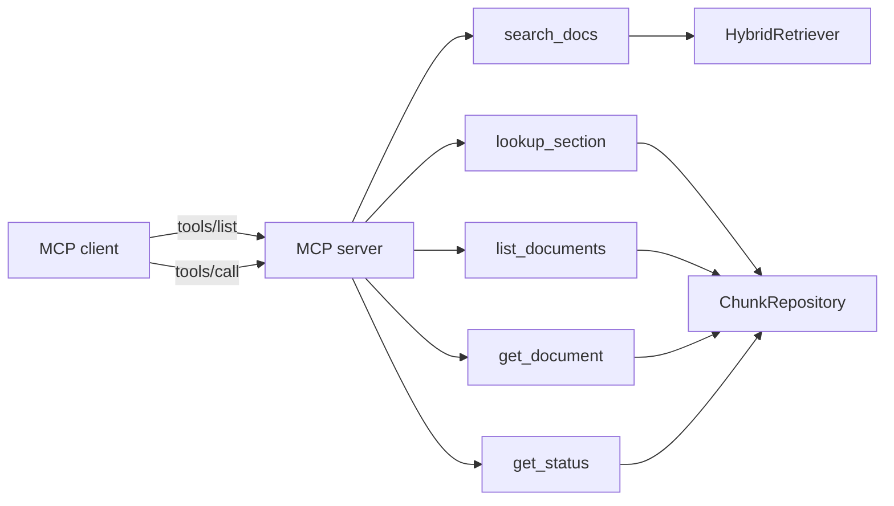

# MCP tools reference

The server exposes five tools under the `arista` MCP namespace. All
classes live in `src/AristaMcp.Server/Tools/` as
`[McpServerToolType]` with constructor DI.

| Tool                | Purpose                                                           |
|---------------------|-------------------------------------------------------------------|
| [`search_docs`](#search_docs)       | Hybrid search returning ranked chunks     |
| [`lookup_section`](#lookup_section) | Full text of a named section              |
| [`list_documents`](#list_documents) | Filter documents by category / product    |
| [`get_document`](#get_document)     | Full metadata + chunk count for one doc   |
| [`get_status`](#get_status)         | Health / stats                            |

Runtime flow:



## `search_docs`

Hybrid dense + sparse + rerank retrieval.

**Input** — arguments accepted by the tool. `candidatePoolSize` and
`rerankTopN` are **not** callable parameters; they are derived
internally as `max(50, topK*5)` and `max(30, topK*3)` respectively.

| Field              | Type     | Default | Notes                                                     |
|--------------------|----------|---------|-----------------------------------------------------------|
| `query`            | string   | —       | Required.                                                 |
| `topK`             | int      | 10      | Final result page size. Clamped to 1–50.                  |
| `category`         | string?  | null    | Live values: `manual`, `reference`, `toi`.                |
| `product`          | string?  | null    | Live values: `eos`, `cvp`, `dmf`, `cv-cue`, `cvw`, `hardware`, `aboot`, `cva`, `mss`, `velocloud`, `cloudeos`, `analytics`, `campus`, `avd`. |
| `dedupPerSection`  | bool     | false   | Drop duplicate chunks from the same document + section.   |
| `withDiagnostics`  | bool     | false   | Include per-stage diagnostics in the response.            |

**Output** — snake_case shape emitted by `SearchDocsTool` (source of
truth: `src/AristaMcp.Server/Tools/SearchDocsTool.cs`).

```jsonc
{
  "results": [
    {
      "chunk_id": 12345,
      "document_id": "abc123",
      "document_title": "Arista Switch 7050X3 Series Data Sheet",
      "document_slug": "7050X3-Datasheet",
      "category": "manual",
      "product": "hardware",
      "version": null,
      "section_title": "MLAG configuration",
      "page_start": 42,
      "page_end": 44,
      "score": 9.81,
      "content": "..."             // includes the "{doc} > {section}\n\n" prefix
    }
  ],
  "diagnostics": {                  // only if withDiagnostics=true
    // per-stage timings and counts from SearchDiagnostics (PascalCase
    // properties: DenseHits, SparseHits, AfterRrf, AfterRerank,
    // EmbedMs, DenseQueryMs, SparseQueryMs, RrfMs, RerankMs, TotalMs,
    // HydeMs, HydeHit, HydeFallback, ListwiseMs, ListwiseHit,
    // ListwiseFallback)
  }
}
```

Notes:

- `score` is the **cross-encoder rerank score**. Dense/BM25 sub-scores are
  fused via RRF before rerank and are not exposed on the result. Enable
  `withDiagnostics` to see per-stage counts and timings.
- `version` is populated only for documents whose catalog entry carries a
  version tag (e.g. EOS release for `eos` docs); often null.
- No `section_level`, no `rawContent`, no separate `rerank_score` /
  `dense_similarity` / `bm25_score` fields.

**Example**

```json
{
  "method": "tools/call",
  "params": {
    "name": "search_docs",
    "arguments": {
      "query": "MLAG peer-link configuration on 7050X3",
      "topK": 5,
      "product": "eos",
      "withDiagnostics": true
    }
  }
}
```

**Query patterns that work well**

- Natural-language questions: *"How do I configure BGP EVPN type-5 routes?"*
- Single concept + platform: *"OSPF single-area campus design"*
- Acronyms: expanded automatically by `QueryExpander`.
- Model numbers: use the `product` filter or include the SKU in the query.

## `lookup_section`

Full text of a named section across its chunks.

**Input**

| Field              | Type    | Default | Notes                                 |
|--------------------|---------|---------|---------------------------------------|
| `documentId`       | string  | —       | Required.                             |
| `sectionTitle`     | string  | —       | Case-insensitive exact match.         |

**Output**

```json
{
  "documentId": "abc123",
  "documentTitle": "...",
  "sectionTitle": "MLAG configuration",
  "content": "...",    // concatenated across all chunks of the section
  "pageStart": 42,
  "pageEnd": 44,
  "chunkCount": 3
}
```

## `list_documents`

Filter documents with optional category / product predicates.

**Input**

| Field      | Type    | Default | Notes                                  |
|------------|---------|---------|----------------------------------------|
| `category` | string? | null    |                                        |
| `product`  | string? | null    |                                        |
| `limit`    | int     | 50      | Clamped 1–500.                          |
| `offset`   | int     | 0       |                                        |

**Output** — array of `{id, title, slug, category, product, pages, chunkCount}`.

## `get_document`

Full metadata + chunk count for a single document.

**Input** — `{documentId: string}`.

**Output** — `{id, url, title, slug, category, product, version, pages,
size_bytes, image_count, section_count, toc_count, tags, chunkCount,
downloadedAt, convertedAt}`.

## `get_status`

Operational snapshot.

**Output**

```json
{
  "chunkCount": 59356,
  "documentCount": 2427,
  "lastIngestRun": {
    "startedAt": "2026-04-23T13:02:05Z",
    "finishedAt": "2026-04-23T13:27:38Z",
    "outcome": "success",
    "documentsSeen": 2427,
    "documentsUpserted": 2427,
    "chunksInserted": 59356
  },
  "embedderModel": "snowflake-arctic-embed-m-v1.5",
  "embedderVariant": "fp32",
  "rerankerFamily": "BertWordPiece",
  "serverVersion": "0.1.4"
}
```

## Error handling

All tools return MCP-standard error payloads on failure:

- `-32602` — invalid params (missing `query`, negative `limit`, …).
- `-32603` — internal error (DB unreachable, embedder model missing).

`search_docs` gracefully degrades when the reranker model is absent
(falls back to `NoopReranker`) so an incomplete local setup still
returns *some* result rather than a hard error.
