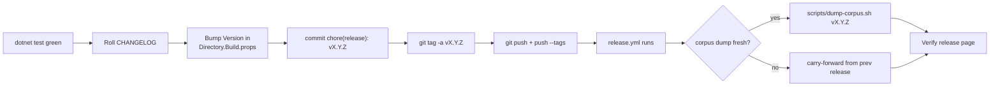

# Release process

Tag-driven. Push an annotated `vX.Y.Z` tag and `.github/workflows/release.yml`
builds + signs + uploads everything. The cut-over operator only does the
local prep (CHANGELOG, version bump, tag, push); the workflow does the rest.



## Pre-flight — you should have

- A green `dotnet build` + `dotnet test` locally.
- All PRs for the release merged to `master`.
- The sprint plan for the release signed-off.
- No `[Unreleased]` entries that belong to a future version —
  move them to a dated future-version section or remove them first.

## 1 — Decide the version

Pre-1.0, bump rules (semver 2.0 pre-1.0 interpretation):

| Change kind                                    | Axis to bump    |
|------------------------------------------------|-----------------|
| New feature, new CLI verb, new bench format    | `0.Y.0` (minor) |
| Bug fix, perf tweak, docs-only                 | `0.y.Z` (patch) |
| Removed feature, breaking MCP contract change  | `0.Y.0` (minor) — noted in CHANGELOG as `Removed` / `Changed` |

When we reach `1.0.0`, switch to strict semver — breaking changes
require major bumps.

## 2 — Roll `CHANGELOG.md`

Open `CHANGELOG.md`. Move every entry under `## [Unreleased]` into a
new section titled with the chosen version and today's ISO-8601 date.
Keep a Changelog 1.1.0 demands the version section be **flat** — don't
nest subsections beyond `Added / Changed / Deprecated / Removed / Fixed / Security`.

Update the compare-link footer:

```md
[Unreleased]: https://github.com/dantte-lp/arista-mcp/compare/v0.3.1...HEAD
[0.3.1]: https://github.com/dantte-lp/arista-mcp/compare/v0.3.0...v0.3.1
```

## 3 — Bump `<Version>` in `Directory.Build.props`

```xml
<PropertyGroup>
  <Version>0.3.1</Version>
  <AssemblyVersion>0.3.0.0</AssemblyVersion>
  <FileVersion>0.3.1.0</FileVersion>
</PropertyGroup>
```

Keep `AssemblyVersion` stable at `X.Y.0.0` across patch releases in the
same minor series — downstream consumers don't rebind. Only bump it on
minor releases.

## 4 — Commit + tag + push

```bash
git add CHANGELOG.md Directory.Build.props
git commit -m "chore(release): v0.3.1"
git tag -a v0.3.1 -m "v0.3.1 — <one-line summary>"
git push origin master
git push --tags
```

The tag push triggers `release.yml`. From here, CI does the rest.

## 5 — What `release.yml` produces

`release.yml` is tag-triggered (`tags: ['v*.*.*']`) and runs 4 stages:

1. **ci gate** — reuses `ci.yml` (`workflow_call`) for build + unit tests.
2. **publish** — matrix x6 RIDs: `linux-x64`, `linux-arm64`, `win-x64`,
   `win-arm64`, `osx-x64`, `osx-arm64`. Single-file self-contained
   binaries (`dotnet publish -p:PublishSingleFile=true --self-contained
   true`). Each archive ships with a `*.sha256` checksum. Uploaded to
   the GitHub Release via `softprops/action-gh-release@v2`.
3. **container** — multi-arch image (`linux/amd64,linux/arm64`) built
   from `docker/Containerfile.app`, pushed to
   `ghcr.io/dantte-lp/arista-mcp:<tag>` + `:latest` (`:latest` only on
   non-prerelease tags). Image is signed with `cosign sign --yes`
   (keyless, OIDC) so consumers can verify provenance.
4. **corpus-dump** — bring-forward: if the new release has no
   `arista-corpus-<tag>.dump` asset, the workflow downloads the most
   recent previous release's dump and uploads it under the new tag.
   Idempotent: skips when the asset is already present.
5. **finalize** — extracts the `## [X.Y.Z]` block from `CHANGELOG.md`
   and overwrites the auto-generated release body.

All third-party actions in `release.yml` are pinned to commit SHAs
(semgrep `third-party-action-not-pinned-to-commit-sha` enforces this).

## 6 — Corpus dump

The full corpus (~2 425 docs, ~117 k chunks) can't be re-generated in
CI — ingest takes ~25 min on a CPU runner and needs the source PDF
catalogue. Two paths:

### 6a — Fresh dump (post-ingest, schema-change releases)

Run from any host with a populated PG container reachable via the
local container runtime:

```bash
# Linux/macOS
scripts/dump-corpus.sh v0.3.1

# Windows
pwsh scripts/dump-corpus.ps1 -Tag v0.3.1
```

Both scripts are idempotent (`gh release upload --clobber` + SHA-256
dedup against the existing release asset) and cross-platform (bash +
pwsh). They `pg_dump -Fc -Z 6 -U arista -d arista` inside the running
`arista-mcp-postgres` container and upload the resulting `~250 MB`
asset (gzip-6 compresses 1.2 GB raw to ~250 MB).

### 6b — Carry-forward (default, no operator action)

If you skip 6a, the `corpus-dump` job in `release.yml` automatically
brings forward the previous release's dump. The resulting asset is
usable as long as the schema didn't change in this release — if it
did, run 6a manually to refresh.

## 7 — Verify

Open <https://github.com/dantte-lp/arista-mcp/releases/tag/v0.3.1> and
check:

- 12 archive assets (6 RID × `tar.gz`/`zip` + `.sha256`).
- `arista-corpus-v0.3.1.dump` + `.sha256`.
- Container at `ghcr.io/dantte-lp/arista-mcp:v0.3.1` (try `podman pull`).
- Release body matches the CHANGELOG section.
- `cosign verify --certificate-identity-regexp '.+' --certificate-oidc-issuer-regexp '.+'`
  passes on the image digest.

## 8 — Announce

For a private repo this usually means a chat message linking the
release page. If we ever go public, add a blog post or README
"what's new" callout.

## Rollback

If a release is fundamentally broken:

1. **Do NOT** force-push or delete the tag — keep audit trail.
2. Cut a `0.Y.Z+1` patch with the fix.
3. Note the broken version in the new version's `### Fixed` section
   with a pointer to the original issue.

## Release cadence

Expectation, not contract:

- Minor (`0.Y.0`): 2–4 week cadence, aligned with sprint gates.
- Patch (`0.Y.Z`): opportunistic when a material fix lands.
- No fixed schedule — release when there's something worth shipping.

## What runs on a release

- `.github/workflows/ci.yml` — build + unit tests on every push and PR.
  Tag push triggers it too. Also called by `release.yml` as gate 1.
- `.github/workflows/e2e.yml` — PostgreSQL service-container E2E.
- `.github/workflows/release.yml` — tag-triggered binary +
  container + corpus dump publication. See Step 5 above.
