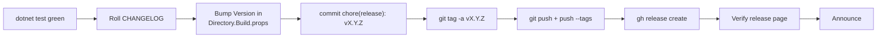

# Release process

Manual cut, 9 steps, ~10 minutes. Script it later if cadence ever
exceeds 1 release / 2 weeks.



## Pre-flight — you should have

- A green `dotnet build` + `dotnet test` locally.
- All PRs for the release merged to `master`.
- The sprint plan for the release signed-off.
- No `[Unreleased]` entries that belong to a future version —
  move them to a dated future-version section or remove them first.

## 1 — Decide the version

Pre-1.0, bump rules (semver 2.0 pre-1.0 interpretation):

| Change kind                                    | Axis to bump    |
|------------------------------------------------|-----------------|
| New feature, new CLI verb, new bench format    | `0.Y.0` (minor) |
| Bug fix, perf tweak, docs-only                 | `0.y.Z` (patch) |
| Removed feature, breaking MCP contract change  | `0.Y.0` (minor) — noted in CHANGELOG as `Removed` / `Changed` |

When we reach `1.0.0`, switch to strict semver — breaking changes
require major bumps.

## 2 — Roll `CHANGELOG.md`

Open `CHANGELOG.md`. Move every entry under `## [Unreleased]` into a
new section titled with the chosen version and today's ISO-8601 date:

```md
## [Unreleased]

_(no entries yet)_

## [0.2.0] — 2026-04-24

### Added
- ... (moved from Unreleased)

### Changed
- ... (moved from Unreleased)
```

Update the compare-link footer:

```md
[Unreleased]: https://github.com/dantte-lp/arista-mcp/compare/v0.2.0...HEAD
[0.2.0]: https://github.com/dantte-lp/arista-mcp/compare/v0.1.4...v0.2.0
[v0.1.4]: ...  (existing, unchanged)
```

Keep a Changelog 1.1.0 demands the version section be **flat** — don't
nest subsections beyond `Added / Changed / Deprecated / Removed / Fixed / Security`.

## 3 — Bump `<Version>` in `Directory.Build.props`

```xml
<PropertyGroup>
  <Version>0.2.0</Version>
  <AssemblyVersion>0.2.0.0</AssemblyVersion>
  <FileVersion>0.2.0.0</FileVersion>
</PropertyGroup>
```

Keep `AssemblyVersion` stable at `X.Y.0.0` across patch releases in the
same minor series — downstream consumers don't rebind. Only bump it on
minor releases.

## 4 — Commit

```bash
git add CHANGELOG.md Directory.Build.props
git commit -m "chore(release): v0.2.0"
```

One-line subject; no body unless there's something release-specific to
call out beyond the CHANGELOG.

## 5 — Tag (annotated, not lightweight)

```bash
git tag -a v0.2.0 -m "v0.2.0 — HyDE scaffolding + bench v2 + bilingual docs"
```

Annotated tags carry a message, date, and tagger — `git describe` and
GitHub's release UI prefer them.

## 6 — Push

```bash
git push origin master
git push --tags
```

If you forget `--tags`, `gh release create` in step 7 will fail —
the tag must exist on the remote first.

## 7 — Create the GitHub Release

Automatic — pulls the section from CHANGELOG as the body:

```bash
# Extract the version's CHANGELOG section into a scratch file.
awk '/^## \[0\.2\.0\]/{f=1} /^## \[/{if(f && !/^## \[0\.2\.0\]/){exit}} f' \
  CHANGELOG.md > /tmp/release-notes.md

gh release create v0.2.0 \
  --title "v0.2.0 — platform polish for measurement + rewrite" \
  --notes-file /tmp/release-notes.md
```

Or, if the CHANGELOG section is short enough to paste manually:

```bash
gh release create v0.2.0 \
  --title "v0.2.0" \
  --notes-from-tag
```

(`--notes-from-tag` uses the `git tag -a` message as the body.)

## 8 — Verify

Open <https://github.com/dantte-lp/arista-mcp/releases/tag/v0.2.0> and
check:

- Title + body match CHANGELOG.
- Source tarballs + zip are attached (GitHub generates them).
- No accidental binary artefacts uploaded.
- Compare view (`...v0.2.0`) shows the expected commit set.

## 9 — Announce (internal)

For a private repo this usually means a Slack / chat message linking
the release page. If we ever go public, add a blog post or README
"what's new" callout.

## Rollback

If a release is fundamentally broken:

1. **Do NOT** force-push or delete the tag — keep audit trail.
2. Cut a `0.2.1` or whatever patch with the fix.
3. Note the broken version in the new version's `### Fixed` section
   with a pointer to the original issue.

## Release cadence

Expectation, not contract:

- Minor (`0.Y.0`): 2–4 week cadence, aligned with sprint gates.
- Patch (`0.Y.Z`): opportunistic when a material fix lands.
- No fixed schedule — release when there's something worth shipping.

## CI — what runs on a release

- `.github/workflows/ci.yml` — build + unit tests on every push, same
  as PRs. Tag push triggers it too.
- `.github/workflows/e2e.yml` — PostgreSQL service-container E2E on
  push to `master` and tags.

Neither workflow publishes artefacts automatically yet (no NuGet, no
container image). Release = tag + GitHub Release page. If we need
artefacts later, add a `.github/workflows/release.yml` triggered on
`push: tags: ['v*']`.
