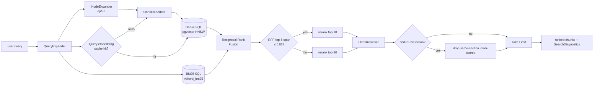

# Retrieval pipeline

From a user query to a ranked list of chunks.



## Stage 1 — `QueryExpander`

Lives in `AristaMcp.Core.Retrieval.QueryExpander`. Static dispatch on a
`FrozenDictionary<string, string>` of 20+ Arista acronyms:

- EVPN → "Ethernet VPN"
- VXLAN → "Virtual Extensible LAN"
- MLAG → "Multi-chassis Link Aggregation Group"
- BGP, OSPF, LACP, sFlow, SR, MSS, AVD, LANZ, VARP, VRRP, VRF, QoS,
  ACL, TCAM, EOS, CVP, DMF

Behaviour:

- Case-insensitive match, original casing preserved in the output.
- Each acronym annotates at most once per query.
- Output carries the raw string *plus* the annotated version; BM25 and
  reranker use the annotated form so acronyms match full-phrase mentions
  in indexed docs without losing the original token.

## Stage 2 — HyDE (opt-in)

When `ARISTA_MCP__Hyde__Enabled=true`, `HydeExpander` calls a local
llama.cpp-compatible chat endpoint (`http://127.0.0.1:8090/v1/chat/completions`
by default) and asks a small instruction-tuned model to write a
*hypothetical answer paragraph* for the query, in the voice of an Arista
technical document.

Only the **dense** path uses the rewritten text. BM25 keeps the raw
query (lexical hallucination = noise) and the cross-encoder keeps the
raw query too (it already has the doc side of the pair for interaction).

Safety:

- 6 s total per-request timeout → fallback to raw query on miss.
- Circuit breaker: 5 consecutive failures → skip for 60 s.
- In-memory cache (`ConcurrentDictionary`, clear-oldest-half to 512).

Current status: off by default. The v0.2.3 probe regressed top-1 by
4.6 pp on the v2 bench — documented for provenance, infrastructure
retained for future experiments with a domain-tuned rewriter.

## Stage 2b — Multi-query expansion (opt-in)

`ARISTA_MCP__MultiQuery__Enabled=true` swaps `NoopMultiQueryExpander`
for a rule-based expander that emits `1..N` reformulations of the raw
query (default `N=3`). Each reformulation runs its own dense + sparse
pass; results are merged before RRF. Sprint 14 shipped the plumbing —
the v2 bench regressed by 1.1 pp top-1 so the flag stays off by default.
Infrastructure kept because the design cost is paid.

## Stage 3 — Embedding (dense path)

`OnnxEmbedder` runs `snowflake-arctic-embed-m-v1.5` on ONNX Runtime:

- Query prefix: `"Represent this sentence for searching relevant passages: "`.
  Applied iff `isQuery: true`; documents embed without a prefix.
- Batched tokenisation via `BertWordPieceTokenizer` → `[input_ids,
  attention_mask]` int64 tensors.
- Model emits pre-pooled `sentence_embedding [B, 768]` float32. **Do not
  re-pool in .NET.** We defensively re-normalise via `TensorPrimitives`
  but the vector is already unit-length.
- Output converted to `Half[768]` → pgvector `halfvec(768)`.

`QueryEmbeddingCache` (256 entries) short-circuits repeated queries with
near-identical normalisation; eviction is clear-oldest-half (not strict
LRU) because this is a perf cache, not a correctness cache.

## Stage 4 — Dual SQL

Two queries issued in parallel via `Task.WhenAll`:

**Dense** — `pgvector` HNSW cosine:

```sql
SELECT c.id, c.document_id, c.chunk_index, c.content, c.raw_content,
       c.section_title, ...
FROM chunks c
JOIN documents d ON c.document_id = d.id
ORDER BY c.embedding <=> $1::halfvec
LIMIT $candidatePoolSize;
```

**Sparse** — `vchord_bm25`:

```sql
SELECT c.id, ..., c.bm25v <&> to_bm25query(
  'idx_chunks_bm25'::regclass,
  tokenize($1, 'chunks_tokenizer')::bm25vector
) AS distance
FROM chunks c
ORDER BY distance ASC
LIMIT $candidatePoolSize;
```

The `<&>` operator returns a **negative** BM25 score, so `ORDER BY …
ASC` ranks the best matches first.

`bm25v` is populated by a PostgreSQL trigger provisioned by
`tokenizer_catalog.create_custom_model_tokenizer_and_trigger`. You never
write to it from application code.

Both queries carry a `WHERE c.chunk_kind = 'leaf'` predicate
(Sprint 15.1 parent-child chunking). Only leaf-level chunks compete for
recall; parent nodes stay in the corpus for section-level lookups but
are invisible to hybrid search. See `docs/en/architecture.md` — the
`chunks.parent_id`/`chunks.chunk_kind` columns encode the tree.

## Stage 5 — Reciprocal Rank Fusion

```
rrf_score(chunk) = Σ_rankers 1 / (k + rank_in_ranker(chunk))
```

Implemented in `HybridRetriever.ReciprocalRankFusion(denseRows,
sparseRows, options.RrfK)` using
`CollectionsMarshal.GetValueRefOrAddDefault` — one hash probe per row
instead of two.

Each `FusedCandidate` tracks **both** `DenseDistance` and
`SparseDistance` through the accumulator, so `SearchDiagnostics` can
report accurate `DenseSimilarity = 1 − cosine_distance` and `Bm25Score
= −sparse_distance` for co-hit chunks.

Default `k = 60` from the original RRF paper; configurable via
`RetrievalOptions.RrfK`.

## Stage 6 — Adaptive rerank depth

Before invoking the cross-encoder, the retriever computes the **spread**
of RRF scores across the top-5 fused candidates. If the spread is ≤
0.02, the top-5 are effectively tied — paying for 30 cross-encoder
passes on noise is waste, so rerank depth floors at **10** regardless
of `RerankTopN`.

## Stage 7 — Cross-encoder rerank

Two implementations dispatch automatically based on files under
`models/reranker/` (see `RerankerFamilyDetector`):

| Trigger file                 | Class                      | Base model                          |
|------------------------------|----------------------------|--------------------------------------|
| `vocab.txt`                  | `OnnxReranker`             | `cross-encoder/ms-marco-MiniLM-L6-v2` (default) |
| `sentencepiece.bpe.model`    | `XlmRobertaOnnxReranker`   | `BAAI/bge-reranker-*` family         |
| neither                      | `NoopReranker`             | passthrough                          |

Each reranker pair-encodes `(query, chunk)` through the model and
returns one logit per pair; higher = more relevant. `HybridRetriever`
re-sorts the fused candidates by this score.

**BERT WordPiece pairing** (`[CLS] q [SEP] d [SEP]` with
`token_type_ids`): used by MiniLM. 512 max seq, batch 8.

**XLM-R SentencePiece pairing** (`<s> q </s></s> d </s>`, no
`token_type_ids`, fairseq-offset remap): used by bge-reranker-v2-m3 etc.

## Stage 7b — Listwise LLM re-rank (opt-in)

`ARISTA_MCP__ListwiseRerank__Enabled=true` wires
`LlamaCppListwiseReranker` after the cross-encoder. The reranker POSTs
the top-5 candidates as a single prompt to the same
llama.cpp-compatible chat endpoint HyDE uses, asks the LLM to return a
JSON permutation, and swaps the top-5 order accordingly. Sprint 16
shipped the plumbing — the v2 bench regressed by 2.4 pp top-1 so the
flag stays off by default. Infrastructure kept for revisit with a
domain-tuned scorer.

## Stage 8 — Dedup + limit

`DedupPerSection` drops lower-scored chunks that share `(document_id,
section_title)` with a better-scored sibling already in the head. Helps
when a long section dominates dense retrieval and you want more diverse
top-K.

Final `Take(options.Limit)` trims to the requested page size.

## Diagnostics

Every `SearchResponse` carries `SearchDiagnostics`:

```csharp
public sealed record SearchDiagnostics(
  int DenseHits, int SparseHits, int AfterRrf, int AfterRerank,
  double EmbedMs, double DenseQueryMs, double SparseQueryMs,
  double RrfMs, double RerankMs, double TotalMs,
  double HydeMs = 0, bool HydeHit = false, bool HydeFallback = false);
```

Every stage reports its own `Stopwatch` elapsed. Don't wrap a second
outer stopwatch around dense/sparse — they'd drift against the per-stage
measurements.

## Observability

`System.Diagnostics.ActivitySource "AristaMcp"` emits spans:

- `search.hybrid` (root)
- `search.embed`
- `search.dense`
- `search.sparse`
- `search.rerank`

Enable OTLP export via `ARISTA_MCP__Otel__Endpoint=http://localhost:4317`
— see [`../otel.md`](../otel.md).

## Where to look in the code

| Concept                | File                                                          |
|------------------------|---------------------------------------------------------------|
| Orchestration          | `src/AristaMcp.Server/Retrieval/HybridRetriever.cs`           |
| Query expansion        | `src/AristaMcp.Core/Retrieval/QueryExpander.cs`               |
| HyDE                   | `src/AristaMcp.Core/Retrieval/IHydeExpander.cs`, `src/AristaMcp.Server/Retrieval/HydeExpander.cs` |
| Multi-query expansion  | `src/AristaMcp.Core/Retrieval/IMultiQueryExpander.cs`, `RuleBasedMultiQueryExpander.cs` |
| Listwise LLM re-rank   | `src/AristaMcp.Server/Retrieval/LlamaCppListwiseReranker.cs`  |
| Embedder               | `src/AristaMcp.Embedding/OnnxEmbedder.cs`                     |
| Reranker family switch | `src/AristaMcp.Core/Settings/RerankerFamilyDetector.cs`       |
| RRF + adaptive cap     | `HybridRetriever.ReciprocalRankFusion`, `ComputeAdaptiveRerankTopN` |
| BM25 tokenisation      | `docker/init.sql` (`create_custom_model_tokenizer_and_trigger`) |
| Schema migrations      | `src/AristaMcp.Data/Migrations/`                              |
