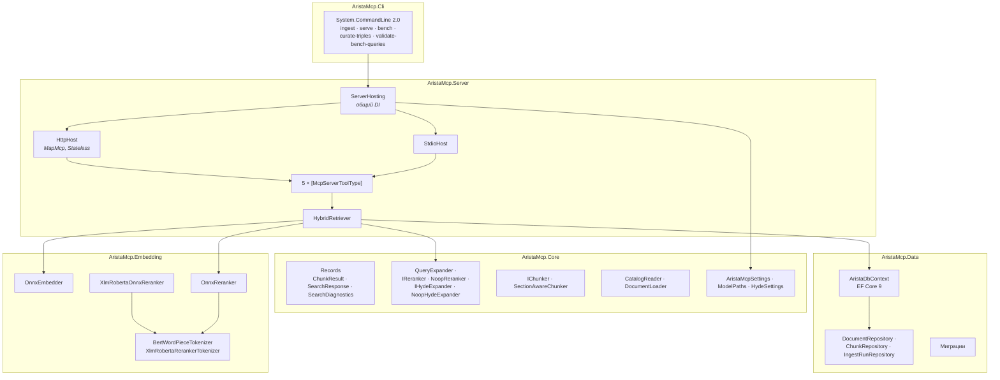
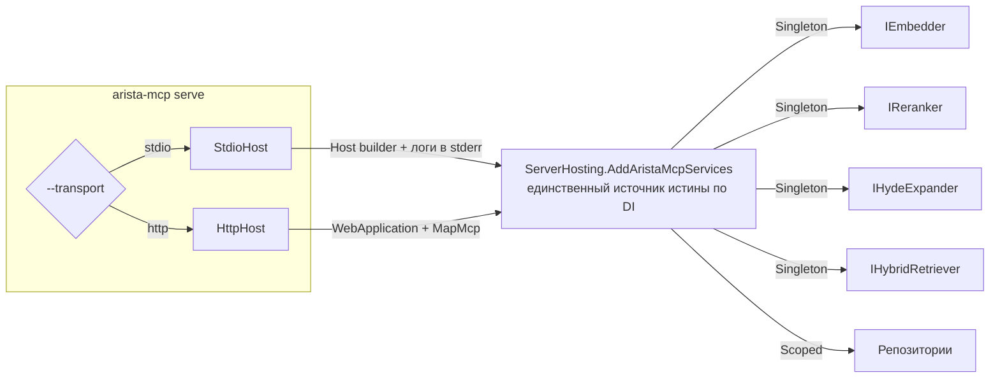
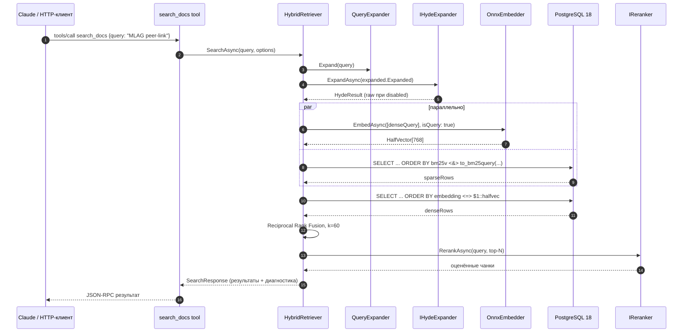
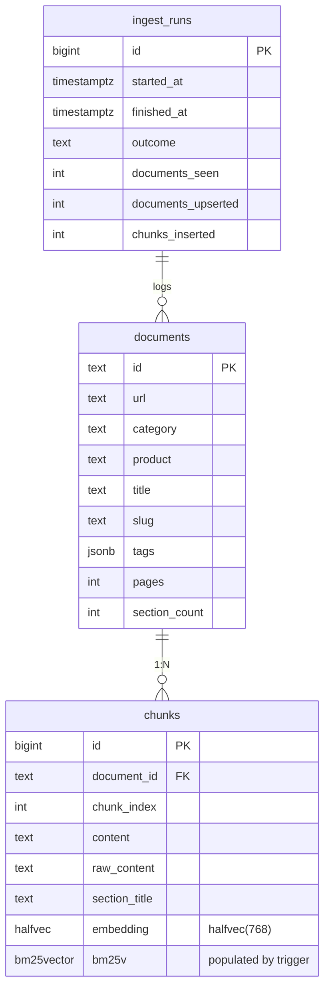

# Архитектура

`arista-mcp` — слоистое .NET 10 приложение с намеренно узкой
поверхностью: одно решение, шесть проектов, одна БД, два MCP-транспорта.

## Карта слоёв



### Строгое правило зависимостей

```
Cli → Server → Core ← Embedding, Data
```

Core **не ссылается** на `Data`, `Embedding` или `Server`. Тесты
могут ссылаться на любой слой. Правило форсится через project-файлы,
а не только конвенцией.

### Зачем нужно разделение

- Core владеет доменным словарём (records, settings) и алгоритмами
  без внешних зависимостей (раскрытие запроса, чанкинг, контракты
  retrieval). Можно менять downstream-проекты без правки доменного
  кода.
- Embedding изолирован, чтобы зависимость от ONNX Runtime (и
  опционально — CUDA runtime) не попадала в весь граф сборки.
  Флаг `-p:UseGpuOnnx=true` переключает на GPU-пакет **только** в
  этом проекте.
- Data содержит все детали SQL / EF Core. `HybridRetriever` живёт в
  Server, потому что выполняет сырой Npgsql — Core не может без
  протяжки Npgsql во всех потребителей.

## Хостинг — два транспорта, один DI-граф



Общий DI-метод гарантирует, что фикс в проводке никогда не попадёт
только в один из транспортов.

## Runtime-последовательность — типичный вызов `search_docs`



Dense-эмбеддинг и sparse-SQL идут параллельно через `Task.WhenAll`.
RRF-фьюжн и реранк дешёвые — остаются на основной задаче.

## Data-слой — эскиз схемы



- `embedding` использует pgvector `halfvec(768)` — вдвое меньше
  `vector(768)` при пренебрежимой потере recall. HNSW-индекс с
  `halfvec_cosine_ops`.
- `bm25v` заполняется триггером PostgreSQL, установленным через
  `tokenizer_catalog.create_custom_model_tokenizer_and_trigger` — в
  колонку не пишем напрямую.

## Версии стека

По состоянию v0.1.4, из `Directory.Packages.props`:

| Пакет                                   | Версия   |
|-----------------------------------------|----------|
| .NET SDK                                | 10.0.201 |
| ModelContextProtocol                    | 1.2.0    |
| EF Core + Npgsql.EFCore + Pgvector.EFCore | 9.0.15 / 9.0.4 / 0.3.0 (держим ради Pgvector) |
| Microsoft.ML.OnnxRuntime                | 1.24.4   |
| Microsoft.ML.Tokenizers                 | 2.0.0    |
| System.CommandLine                      | 2.0.6    |
| PostgreSQL                              | 18 (образ tensorchord/vchord-suite) |
| pgvector / vchord / vchord_bm25 / pg_tokenizer | 0.8.2 / 1.1.1 / 0.3.0 / 0.1.1 |

## Дальше

- [retrieval.md](retrieval.md) — каждый этап пайплайна поиска подробно.
- [getting-started.md](getting-started.md) — как поднять стек.
- [../../CLAUDE.md](../../CLAUDE.md) — операционные нюансы по спринтам.
