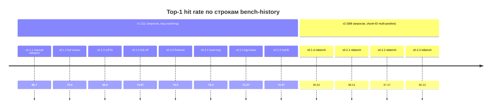
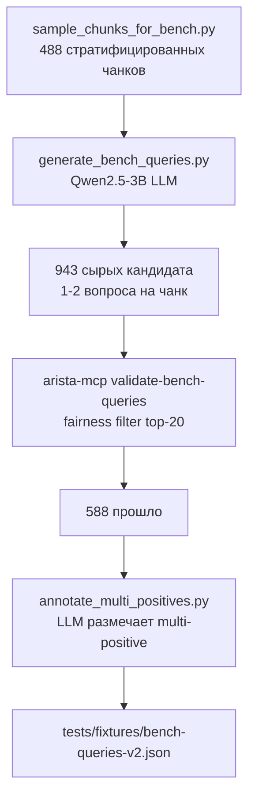

# Бенчмаркинг

Проект поставляет два бенч-набора и append-only историю, так что
дельты качества retrieval видны во времени.

## Bench-history одним взглядом

`tests/fixtures/bench-history.jsonl` — долгоиграющий лог. Одна строка
на вызов `arista-mcp bench … --history --label`.



## Две версии бенча, один harness

### v1 — 111 запросов, substring-scoring по slug

`tests/fixtures/bench-queries.json`. Курировалось вручную по
распределению продуктов каталога. Каждый запрос несёт:

- `expect_any: [string]` — substring-токены, которые матчатся с
  `slug` и `title` документа.
- `expect_product: string?` — опциональный exact-match на
  `ChunkResult.Product` для продуктов типа `hardware`, которые
  используют model-number slug'и.

Запрос считается **hit**, если любой возвращённый результат матчится
любому правилу.

**Известная проблема.** Substring-эвристика систематически
under-count'ит, когда реранкер ставит *валидный-но-иначе-слагнутый*
чанк как rank 0. Стоковый MiniLM консистентно приземлялся на top-1
72–74 % на v1 через пять несвязанных экспериментов (stock, fine-tune,
bge-base, HyDE), где вся ±1.8 pp вариация объяснялась флипом двух
запросов между rank 1 и rank 2–10. При n=111 σ = ±4.2 pp — ниже
measurement floor для +2 pp уплифта.

### v2 — 588 запросов, chunk-ID multi-positive scoring

`tests/fixtures/bench-queries-v2.json`. Сгенерировано Sprint 13
пайплайном:



Каждый запрос несёт:

```jsonc
{
  "query": "what is the minimum TPM version required for compatibility?",
  "source_chunk_id": 75099,
  "expect_any_of_chunk_ids": [75099, 131398],
  "product": "eos",
  "source_doc_title": "...",
  "source_section_title": "...",
  "generation_model": "qwen2.5-3b-instruct"
}
```

Запрос считается **hit**, если `chunkId` любого возвращённого
результата есть в `expect_any_of_chunk_ids`. v1 эвристики
`expect_any` / `expect_product` игнорируются, когда
`expect_any_of_chunk_ids` заполнен.

**Распределение позитивов:**

| Позитивов на запрос | Запросов | % набора |
|---------------------|----------|----------|
| 1                   | 204      | 35 %     |
| 2                   | 184      | 31 %     |
| 3                   | 98       | 17 %     |
| 4–6                 | 70       | 12 %     |
| 7–10                | 32       | 5 %      |

65 % запросов имеют больше одного валидного чанка — это то, что v1
substring-scoring сплющивал.

**Статистическая мощь:** σ ≈ 1.3 pp при n=588 и p ≈ 0.9. Реальный
+3 pp uplift детектируется с ~95 % уверенностью, well above v1
±4.2 pp floor.

## Запуск бенча

```bash
# v2 по умолчанию (рекомендовано для новых экспериментов)
dotnet run --project src/AristaMcp.Cli -- bench \
  --queries tests/fixtures/bench-queries-v2.json \
  --limit 10 \
  --history tests/fixtures/bench-history.jsonl \
  --label my-experiment

# v1 для исторического сравнения
dotnet run --project src/AristaMcp.Cli -- bench \
  --queries tests/fixtures/bench-queries.json \
  --limit 10 \
  --history tests/fixtures/bench-history.jsonl \
  --label my-experiment-v1
```

Harness выбирает правило scoring по `bench_queries.version` во
входном файле. v2 строки получают `query_set_version: 2` в history,
так что v1 и v2 не перепутаются потом.

## Чтение строки

```json
{
  "date": "2026-04-24T00:32:17.123Z",
  "label": "v0.1.4-rebench-v2",
  "query_set_version": 2,
  "query_count": 588,
  "top_k": 10,
  "top1_hit_rate": 90.82,
  "topk_hit_rate": 100.0,
  "latency_p50_ms": 550.2,
  "latency_p95_ms": 818.8,
  "latency_avg_ms": 560.3
}
```

- `top1_hit_rate` — % запросов, где валидный чанк стоит на rank 0.
  Первичный сигнал качества реранкера.
- `topk_hit_rate` — % с валидным чанком где угодно в top-K. Меряет
  **retrieval** (dense + BM25 + RRF). На v2 почти всегда = 100,
  потому что fairness-filter выкинул запросы, которые retriever не
  мог найти.
- `latency_p*_ms` — end-to-end `SearchAsync`. На CPU-only stock
  MiniLM на 12-ядерном хосте: p50 ~550 ms, p95 ~820 ms на v2
  (588 запросов).

## Расширение бенча (перегенерация v2)

Скрипты пайплайна живут в соседнем
[`arista-reranker-tune`](../../../../arista-reranker-tune) репозитории
(submodule-стайл, не версионировано здесь).

```bash
# Из C:/SHARE/arista-reranker-tune (WSL2 Ubuntu с uv)

# 1. Сэмплинг чанков из postgres
uv run python scripts/sample_chunks_for_bench.py \
  --out data/bench-seed-chunks.jsonl --target 500

# 2. Поднять llama.cpp sidecar с Qwen2.5-3B
podman compose -f ../arista-mcp/docker/compose.yaml --profile llm up -d

# 3. LLM-генерация запросов (~45 мин на 500 чанков на CPU)
uv run python scripts/generate_bench_queries.py \
  --in data/bench-seed-chunks.jsonl \
  --out data/bench-queries-raw.jsonl --resume

# 4. Fairness-filter через текущий retriever (~12 мин)
cd ../arista-mcp
dotnet run --project src/AristaMcp.Cli -- validate-bench-queries \
  --input ../arista-reranker-tune/data/bench-queries-raw.jsonl \
  --output ../arista-reranker-tune/data/bench-queries-validated.jsonl \
  --top-k 20

# 5. Multi-positive разметка (~3 ч на CPU)
cd ../arista-reranker-tune
uv run python scripts/annotate_multi_positives.py \
  --in data/bench-queries-validated.jsonl \
  --out ../arista-mcp/tests/fixtures/bench-queries-v2.json
```

## Как читать строки для реальных решений

- **Ниже σ = шум.** Не гоняться за +1 pp разницей на v2 — это внутри
  measurement floor.
- **Сравнивать с baseline `*-rebench-v2`**, не с v1-строками. v1
  строки — исторические under-count и никогда не должны сравниваться
  с v2.
- **Латентность-регрессии надёжно измеримы** в отличие от sub-σ
  quality-дельт. Бенч, который набрал 0.5 pp top-1 при удвоении p95
  — не победа.
- **Смотреть на top-10.** Если top-10 падает при росте top-1, что-то
  в retrieval-ветке откатилось, компенсируя реранкерный выигрыш —
  разбираться до промоушена.
