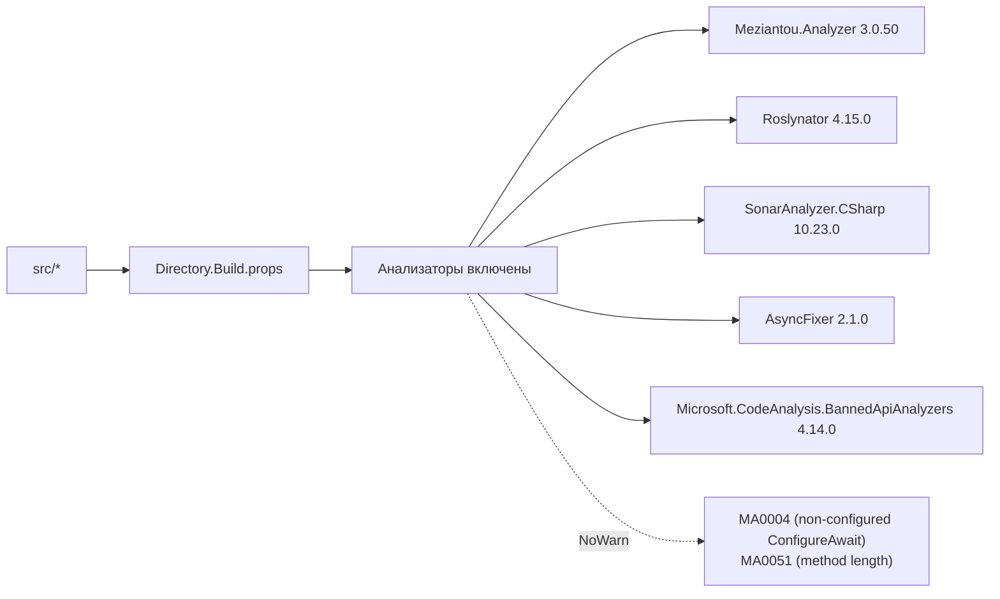

# Разработка

Сборка, тесты, вклад.

## Сборка

```bash
dotnet build                   # Debug, все проекты, все анализаторы
dotnet build -c Release        # Release
dotnet build -p:UseGpuOnnx=true   # Swap CPU → GPU ONNX Runtime
```

Solution определён в `arista-mcp.slnx`. Central package management
живёт в `Directory.Packages.props` — **версии добавлять туда**, не
в project-файлы.

`global.json` пинит SDK на 10.0.201.

## Тесты

```bash
dotnet test                    # полный набор: unit + integration + E2E
dotnet test --filter "FullyQualifiedName~HyDE"   # узкий фильтр
dotnet test tests/AristaMcp.Embedding.Tests/     # один проект
```

Интеграционные + E2E тесты требуют:

- Запущенный Podman postgres (`podman compose up -d postgres`).
- `PgvectorFixture` цепляется к БД `arista_test` и отказывается от
  всего остального через guard по суффиксу; override через
  `ARISTA_MCP_TEST_CS`.

SkippableFact-ы защищают тесты, которым нужны файлы моделей или
ingested-корпус — они чисто скипаются на голом чекауте.

## Локальный запуск

```bash
dotnet run --project src/AristaMcp.Cli -- serve --transport stdio
dotnet run --project src/AristaMcp.Cli -- serve --transport http --port 8080
dotnet run --project src/AristaMcp.Cli -- bench --queries tests/fixtures/bench-queries-v2.json
dotnet run --project src/AristaMcp.Cli -- ingest --catalog ../arista-docs/catalog.json
```

## Стиль кода + анализаторы



Правила для всего репо:

- **Один тип на файл** (MA0048). Разделять records + классы + enum'ы
  по отдельным файлам даже когда они близко связаны.
- **Избегать `DateTimeOffset.UtcNow`** в новом коде — инжектить
  `TimeProvider` из DI. Prod регистрирует `TimeProvider.System`;
  тесты используют `FakeTimeProvider` из
  `Microsoft.Extensions.TimeProvider.Testing`.
- **Никаких `.ConfigureAwait(false)` suppression** (MA0004 глобально
  подавлено для console/ASP.NET Core контекстов).
- **Никаких `Select + ToArray`-аллокаций в hot path**;
  `CollectionsMarshal`, `TensorPrimitives` и collection-expressions
  предпочтительнее — см. `HybridRetriever.ReciprocalRankFusion`.
- **Sealed по умолчанию** — entity + repository классы запечатаны.
- **Banned APIs** (`BannedSymbols.txt`) — не добавлять без обсуждения.

Тесты получают доп. послабление через `tests/Directory.Build.props`:

- `CA1707` (underscore имена) — snake_case имена тестовых методов ок.
- `CA1711` (xUnit `*Collection`-именование) — атрибут `[Collection]`
  это требует.
- `MA0004`, `MA0051` — тело теста длинное и не нуждается в
  ConfigureAwait.

## Правило слоёв — форсится, не декоративно

```
Cli → Server → Core ← Embedding, Data
```

- `AristaMcp.Core` **не ссылается** на Data, Embedding или Server.
  Project-файлы это форсят — попытка добавить ссылку ломает
  `dotnet build`.
- Тесты могут ссылаться на любой слой.

Почему: Core хостит доменные records + алгоритмические интерфейсы.
В момент, когда он ссылается на Npgsql или ONNX, каждый downstream
потребитель наследует эти бинарники. Держать core deep-light —
one-way door: легко потерять, сложно вернуть.

## Добавление нового MCP-инструмента

1. Создать `src/AristaMcp.Server/Tools/MyTool.cs` с атрибутом
   `[McpServerToolType]` на классе и `[McpServerTool(Name =
   "my_tool")]` на public-методе.
2. Объявить сигнатуру метода — входы параметры, выход возвращается
   напрямую (JSON-сериализуется SDK).
3. Инжектить DI-сервисы через конструктор.
4. Регистрация через существующий сканнер — `ServerHosting`
   подхватывает инструменты автоматически.
5. Написать хотя бы один интеграционный тест в
   `tests/AristaMcp.Server.Tests/`.
6. Задокументировать в [`mcp-tools.md`](mcp-tools.md).

## Добавление нового CLI-verb

1. Новый класс `src/AristaMcp.Cli/Commands/MyCommand.cs` со статическим
   `Build()`, возвращающим `System.CommandLine.Command`.
2. Завести options через `Option<T>`, поставить `Required = true`
   где нужно.
3. `cmd.SetAction(async (ParseResult pr, CancellationToken ct) => …)`.
4. Зарегистрировать в `src/AristaMcp.Cli/Program.cs`.
5. Обновить таблицу verb-ов в README + эту страницу, если
   user-facing.

## Миграции БД

```bash
cd src/AristaMcp.Data
dotnet ef migrations add MyChange --startup-project .
dotnet ef database update --startup-project .
```

Папка `Migrations/` имеет свой `.editorconfig` с отключёнными
анализаторами на EF-сгенерированный код — не редактировать
`Designer.cs` руками.

## Observability-хуки

При добавлении новой retrieval- или ingest-стадии, достойной трейсинга,
заводи спан под существующий `ActivitySource "AristaMcp"`:

```csharp
using var span = AristaActivity.Source.StartActivity(AristaActivity.Operations.MyStage);
span?.SetTag(AristaActivity.Tags.SomeTag, value);
```

Имена operation + tag — константы под
`src/AristaMcp.Core/Observability/AristaActivity.cs`. Имя самого
source (`AristaMcp`) — стабильный контракт для downstream-дашбордов,
не переименовывать.

## Workflow вклада

1. Перед нетривиальным изменением — глянуть `CLAUDE.md` и
   релевантный sprint-план под `docs/superpowers/plans/`.
2. Ветка от `master`. Один логический change на коммит.
3. `dotnet build` + `dotnet test` должны быть зелёными до push.
4. Обновить [`CHANGELOG.md`](../../CHANGELOG.md) секцию `[Unreleased]`
   с user-visible изменениями (формат: Keep a Changelog 1.1.0).
5. Если трогал retrieval quality — прогнать `bench --history --label
   my-change-vN` на v2 и приложить row-diff в body PR.
