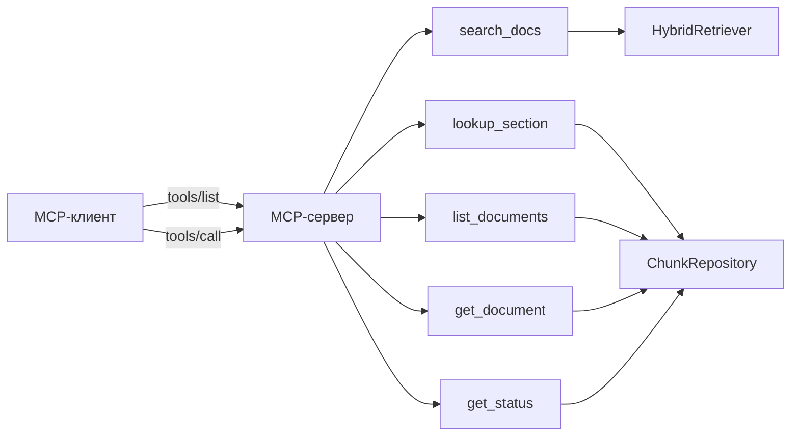

# Справочник MCP-инструментов

Сервер экспонирует пять инструментов в MCP-неймспейсе `arista`. Все
классы живут в `src/AristaMcp.Server/Tools/` как
`[McpServerToolType]` с ctor-DI.

| Инструмент            | Назначение                                                          |
|-----------------------|----------------------------------------------------------------------|
| [`search_docs`](#search_docs)       | Гибридный поиск — ранжированные чанки + опц. диагностика |
| [`lookup_section`](#lookup_section) | Полный текст именованной секции                         |
| [`list_documents`](#list_documents) | Фильтр документов по category / product                 |
| [`get_document`](#get_document)     | Полные метаданные + кол-во чанков для одного документа  |
| [`get_status`](#get_status)         | Health / статистика                                     |

Runtime-поток:



## `search_docs`

Гибридный dense + sparse + rerank поиск.

**Вход** — аргументы, которые инструмент принимает. `candidatePoolSize`
и `rerankTopN` **не являются** параметрами вызова; они вычисляются
внутри как `max(50, topK*5)` и `max(30, topK*3)` соответственно.

| Поле               | Тип       | Дефолт  | Примечания                                              |
|--------------------|-----------|---------|----------------------------------------------------------|
| `query`            | string    | —       | Обязательный.                                            |
| `topK`             | int       | 10      | Размер финальной страницы. Ограничено 1–50.              |
| `category`         | string?   | null    | Живые значения: `manual`, `reference`, `toi`.            |
| `product`          | string?   | null    | Живые значения: `eos`, `cvp`, `dmf`, `cv-cue`, `cvw`, `hardware`, `aboot`, `cva`, `mss`, `velocloud`, `cloudeos`, `analytics`, `campus`, `avd`. |
| `dedupPerSection`  | bool      | false   | Выкинуть дубли чанков из одной пары документ + секция.   |
| `withDiagnostics`  | bool      | false   | Включить в ответ per-stage диагностику.                  |

**Выход** — snake_case-форма, которую эмитит `SearchDocsTool` (источник
истины: `src/AristaMcp.Server/Tools/SearchDocsTool.cs`).

```jsonc
{
  "results": [
    {
      "chunk_id": 12345,
      "document_id": "abc123",
      "document_title": "Arista Switch 7050X3 Series Data Sheet",
      "document_slug": "7050X3-Datasheet",
      "category": "manual",
      "product": "hardware",
      "version": null,
      "section_title": "MLAG configuration",
      "page_start": 42,
      "page_end": 44,
      "score": 9.81,
      "content": "..."             // включает префикс "{doc} > {section}\n\n"
    }
  ],
  "diagnostics": {                  // только при withDiagnostics=true
    // per-stage тайминги и счётчики из SearchDiagnostics (PascalCase-
    // свойства: DenseHits, SparseHits, AfterRrf, AfterRerank,
    // EmbedMs, DenseQueryMs, SparseQueryMs, RrfMs, RerankMs, TotalMs,
    // HydeMs, HydeHit, HydeFallback, ListwiseMs, ListwiseHit,
    // ListwiseFallback)
  }
}
```

Замечания:

- `score` — это **скор cross-encoder-реранка**. Dense/BM25 sub-скоры
  сливаются через RRF до реранка и на результат не выводятся. Включи
  `withDiagnostics`, чтобы увидеть per-stage счётчики и тайминги.
- `version` заполняется только для документов, у которых в каталоге
  проставлен тег версии (например, EOS-релиз для `eos`-доков); часто
  null.
- Ни `section_level`, ни `rawContent`, ни отдельных полей
  `rerank_score` / `dense_similarity` / `bm25_score`.

**Пример**

```json
{
  "method": "tools/call",
  "params": {
    "name": "search_docs",
    "arguments": {
      "query": "MLAG peer-link configuration on 7050X3",
      "topK": 5,
      "product": "eos",
      "withDiagnostics": true
    }
  }
}
```

**Паттерны запросов, которые работают хорошо**

- Естественно-языковые вопросы: *"Как настроить BGP EVPN type-5 routes?"*
- Одиночный концепт + платформа: *"OSPF single-area campus design"*
- Акронимы: раскрываются автоматически через `QueryExpander`.
- Model-номера: использовать фильтр `product` или включать SKU в
  запрос.

## `lookup_section`

Полный текст именованной секции по её чанкам.

**Вход**

| Поле               | Тип      | Дефолт  | Примечания                             |
|--------------------|----------|---------|-----------------------------------------|
| `documentId`       | string   | —       | Обязательный.                           |
| `sectionTitle`     | string   | —       | Регистронезависимый exact match.        |

**Выход**

```json
{
  "documentId": "abc123",
  "documentTitle": "...",
  "sectionTitle": "MLAG configuration",
  "content": "...",    // склеено по всем чанкам секции
  "pageStart": 42,
  "pageEnd": 44,
  "chunkCount": 3
}
```

## `list_documents`

Фильтр документов с опциональными предикатами category / product.

**Вход**

| Поле       | Тип     | Дефолт  | Примечания                              |
|------------|---------|---------|-----------------------------------------|
| `category` | string? | null    |                                          |
| `product`  | string? | null    |                                          |
| `limit`    | int     | 50      | Ограничено 1–500.                        |
| `offset`   | int     | 0       |                                          |

**Выход** — массив `{id, title, slug, category, product, pages, chunkCount}`.

## `get_document`

Полные метаданные + количество чанков для одного документа.

**Вход** — `{documentId: string}`.

**Выход** — `{id, url, title, slug, category, product, version, pages,
size_bytes, image_count, section_count, toc_count, tags, chunkCount,
downloadedAt, convertedAt}`.

## `get_status`

Операционный снимок.

**Выход**

```json
{
  "chunkCount": 59356,
  "documentCount": 2427,
  "lastIngestRun": {
    "startedAt": "2026-04-23T13:02:05Z",
    "finishedAt": "2026-04-23T13:27:38Z",
    "outcome": "success",
    "documentsSeen": 2427,
    "documentsUpserted": 2427,
    "chunksInserted": 59356
  },
  "embedderModel": "snowflake-arctic-embed-m-v1.5",
  "embedderVariant": "fp32",
  "rerankerFamily": "BertWordPiece",
  "serverVersion": "0.1.4"
}
```

## Обработка ошибок

Все инструменты возвращают MCP-стандартные error-пейлоады при сбое:

- `-32602` — invalid params (отсутствует `query`, отрицательный `limit`, …).
- `-32603` — internal error (БД недоступна, embedder model отсутствует).

`search_docs` gracefully деградирует, если модель реранкера отсутствует
(fallback на `NoopReranker`), так что неполный локальный сетап всё
равно возвращает *какой-то* результат, а не hard error.
