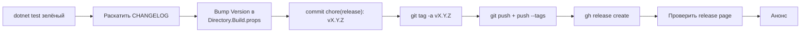

# Процесс релиза

Ручной cut, 9 шагов, ~10 минут. Автоматизировать имеет смысл если
частота превысит 1 релиз / 2 недели.



## Pre-flight — что должно быть

- Зелёные `dotnet build` + `dotnet test` локально.
- Все PR релиза смёржены в `master`.
- Спринт-план релиза согласован.
- Никаких `[Unreleased]` записей, которые относятся к будущей версии —
  сначала переместить их в датированную будущую секцию или удалить.

## 1 — Выбрать версию

Pre-1.0, правила bump-а (semver 2.0 pre-1.0 интерпретация):

| Вид изменения                                   | Ось bump-а      |
|--------------------------------------------------|-----------------|
| Новая фича, новый CLI verb, новый bench-формат   | `0.Y.0` (minor) |
| Bug fix, perf-тюнинг, docs-only                  | `0.y.Z` (patch) |
| Удалённая фича, breaking-change MCP-контракта    | `0.Y.0` (minor) — в CHANGELOG как `Removed` / `Changed` |

При переходе на `1.0.0` — строгий semver: breaking-changes требуют
major-bump.

## 2 — Раскатить `CHANGELOG.md`

Открыть `CHANGELOG.md`. Переместить все записи из `## [Unreleased]`
в новую секцию с выбранной версией и сегодняшней датой в ISO-8601:

```md
## [Unreleased]

_(no entries yet)_

## [0.2.0] — 2026-04-24

### Added
- ... (перенесено из Unreleased)

### Changed
- ... (перенесено из Unreleased)
```

Обновить compare-link-footer:

```md
[Unreleased]: https://github.com/dantte-lp/arista-mcp/compare/v0.2.0...HEAD
[0.2.0]: https://github.com/dantte-lp/arista-mcp/compare/v0.1.4...v0.2.0
[v0.1.4]: ...  (существующее, без изменений)
```

Keep a Changelog 1.1.0 требует секцию версии **плоской** — не
вложенные подсекции глубже чем `Added / Changed / Deprecated / Removed
/ Fixed / Security`.

## 3 — Bump `<Version>` в `Directory.Build.props`

```xml
<PropertyGroup>
  <Version>0.2.0</Version>
  <AssemblyVersion>0.2.0.0</AssemblyVersion>
  <FileVersion>0.2.0.0</FileVersion>
</PropertyGroup>
```

Держать `AssemblyVersion` стабильным на `X.Y.0.0` через patch-релизы
в одном minor — downstream-консумеры не rebind-ят. Bump-ать только
на minor-релизах.

## 4 — Commit

```bash
git add CHANGELOG.md Directory.Build.props
git commit -m "chore(release): v0.2.0"
```

Однострочный subject; body только если есть что-то специфичное для
релиза кроме CHANGELOG.

## 5 — Tag (аннотированный, не lightweight)

```bash
git tag -a v0.2.0 -m "v0.2.0 — HyDE scaffolding + bench v2 + bilingual docs"
```

Аннотированные теги несут сообщение, дату и tagger-а — `git describe`
и GitHub Release UI их предпочитают.

## 6 — Push

```bash
git push origin master
git push --tags
```

Если забыть `--tags`, `gh release create` на шаге 7 упадёт — тег
должен существовать на remote сначала.

## 7 — Создать GitHub Release

Автоматически — тянет секцию CHANGELOG как body:

```bash
# Выдрать секцию версии в scratch-файл.
awk '/^## \[0\.2\.0\]/{f=1} /^## \[/{if(f && !/^## \[0\.2\.0\]/){exit}} f' \
  CHANGELOG.md > /tmp/release-notes.md

gh release create v0.2.0 \
  --title "v0.2.0 — platform polish for measurement + rewrite" \
  --notes-file /tmp/release-notes.md
```

Или, если секция CHANGELOG короткая:

```bash
gh release create v0.2.0 \
  --title "v0.2.0" \
  --notes-from-tag
```

(`--notes-from-tag` использует сообщение `git tag -a` как body.)

## 8 — Проверка

Открыть <https://github.com/dantte-lp/arista-mcp/releases/tag/v0.2.0>
и проверить:

- Title + body соответствуют CHANGELOG.
- Source tarball + zip приаттачены (GitHub генерит).
- Случайно не загружены бинарные артефакты.
- Compare view (`...v0.2.0`) показывает ожидаемый набор коммитов.

## 9 — Анонс (внутренний)

Для приватного репо обычно = Slack / chat сообщение со ссылкой на
release page. Если когда-нибудь пойдём в public, добавить blog post
или README "what's new" callout.

## Rollback

Если релиз фундаментально сломан:

1. **Не делать** force-push или удалять тег — сохраняем audit trail.
2. Cut-нуть `0.2.1` или нужный patch с фиксом.
3. Упомянуть сломанную версию в новой секции `### Fixed` с
   pointer-ом на исходную проблему.

## Частота релизов

Ожидание, не контракт:

- Minor (`0.Y.0`): 2–4 недели, align на sprint-гейты.
- Patch (`0.Y.Z`): opportunistic когда приземлился существенный фикс.
- Нет фиксированного расписания — релиз когда есть что отгружать.

## CI — что бегает на релизе

- `.github/workflows/ci.yml` — build + unit-тесты на каждый push,
  так же как на PR. Push тега тоже триггерит.
- `.github/workflows/e2e.yml` — PostgreSQL service-container E2E на
  push в `master` и тегах.

Ни один workflow пока не публикует артефакты автоматически (нет
NuGet, нет container image). Release = тег + GitHub Release page.
Если понадобятся артефакты, добавить `.github/workflows/release.yml`
триггером на `push: tags: ['v*']`.
