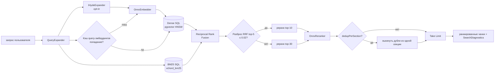

# Пайплайн поиска

От пользовательского запроса до ранжированного списка чанков.



## Этап 1 — `QueryExpander`

Находится в `AristaMcp.Core.Retrieval.QueryExpander`. Статический
диспатч по `FrozenDictionary<string, string>` из 20+ акронимов
Arista:

- EVPN → "Ethernet VPN"
- VXLAN → "Virtual Extensible LAN"
- MLAG → "Multi-chassis Link Aggregation Group"
- BGP, OSPF, LACP, sFlow, SR, MSS, AVD, LANZ, VARP, VRRP, VRF, QoS,
  ACL, TCAM, EOS, CVP, DMF

Поведение:

- Регистронезависимый матч, оригинальный регистр сохраняется в
  выходе.
- Каждый акроним аннотируется не больше одного раза на запрос.
- Выход несёт исходную строку **плюс** аннотированную версию; BM25
  и реранкер используют аннотированную форму, чтобы акронимы
  матчились с полнофразовыми упоминаниями в индексе, не теряя
  оригинального токена.

## Этап 2 — HyDE (opt-in)

При `ARISTA_MCP__Hyde__Enabled=true` `HydeExpander` вызывает локальный
llama.cpp-совместимый chat-endpoint (`http://127.0.0.1:8090/v1/chat/completions`
по умолчанию) и просит небольшую instruction-tuned модель написать
*гипотетический параграф-ответ* на запрос в стиле технической документации
Arista.

Только **dense**-ветка использует перезаписанный текст. BM25 остаётся
на исходном запросе (лексические галлюцинации = шум), cross-encoder
тоже остаётся на исходном (у него уже есть документная сторона пары
для взаимодействия).

Безопасность:

- 6 s общий таймаут на запрос → fallback на raw query при провале.
- Circuit breaker: 5 подряд фейлов → пропуск на 60 s.
- Кэш в памяти (`ConcurrentDictionary`, clear-oldest-half до 512).

Текущий статус: выключено по умолчанию. Проба v0.2.3 уронила top-1 на
4.6 pp на v2-бенче — задокументировано ради истории, инфраструктура
оставлена для будущих экспериментов с domain-tuned переписывателем.

## Этап 2b — Multi-query expansion (opt-in)

При `ARISTA_MCP__MultiQuery__Enabled=true` `NoopMultiQueryExpander`
заменяется на rule-based expander, который эмитит `1..N` переформулировок
исходного запроса (по умолчанию `N=3`). Каждая переформулировка идёт
своим dense + sparse проходом; результаты сливаются до RRF. Sprint 14
накатил инфру — v2-бенч регрессировал на 1.1 pp top-1, так что флаг по
умолчанию выключен. Инфраструктура сохранена, потому что дизайнерская
работа уже оплачена.

## Этап 3 — Эмбеддинг (dense-ветка)

`OnnxEmbedder` гоняет `snowflake-arctic-embed-m-v1.5` на ONNX Runtime:

- Префикс query: `"Represent this sentence for searching relevant passages: "`.
  Применяется iff `isQuery: true`; документы эмбеддятся без префикса.
- Батч-токенизация через `BertWordPieceTokenizer` → `[input_ids,
  attention_mask]` int64-тензоры.
- Модель возвращает pre-pooled `sentence_embedding [B, 768]` float32.
  **Не делайте повторный pooling в .NET.** Мы defensive-нормализуем
  через `TensorPrimitives`, но вектор уже единичной длины.
- Выход конвертируется в `Half[768]` → pgvector `halfvec(768)`.

`QueryEmbeddingCache` (256 entries) замыкает повторные запросы с
почти идентичной нормализацией; eviction — clear-oldest-half (не
строгий LRU), потому что это perf-кэш, а не correctness-кэш.

## Этап 4 — Двойной SQL

Два запроса идут параллельно через `Task.WhenAll`:

**Dense** — `pgvector` HNSW cosine:

```sql
SELECT c.id, c.document_id, c.chunk_index, c.content, c.raw_content,
       c.section_title, ...
FROM chunks c
JOIN documents d ON c.document_id = d.id
ORDER BY c.embedding <=> $1::halfvec
LIMIT $candidatePoolSize;
```

**Sparse** — `vchord_bm25`:

```sql
SELECT c.id, ..., c.bm25v <&> to_bm25query(
  'idx_chunks_bm25'::regclass,
  tokenize($1, 'chunks_tokenizer')::bm25vector
) AS distance
FROM chunks c
ORDER BY distance ASC
LIMIT $candidatePoolSize;
```

Оператор `<&>` возвращает **отрицательный** BM25-score, так что
`ORDER BY … ASC` ставит лучшие матчи первыми.

`bm25v` заполняется триггером PostgreSQL, установленным
`tokenizer_catalog.create_custom_model_tokenizer_and_trigger`. В
колонку не пишем из application-кода.

Оба запроса несут предикат `WHERE c.chunk_kind = 'leaf'` (parent-child
чанкинг Sprint 15.1). За recall конкурируют только leaf-чанки; parent-узлы
остаются в корпусе для секционного lookup'а, но невидимы для гибридного
поиска. См. `docs/en/architecture.md` — колонки `chunks.parent_id` /
`chunks.chunk_kind` кодируют дерево.

## Этап 5 — Reciprocal Rank Fusion

```
rrf_score(chunk) = Σ_ranker-ов 1 / (k + rank_в_ranker-e(chunk))
```

Реализовано в `HybridRetriever.ReciprocalRankFusion(denseRows,
sparseRows, options.RrfK)` через
`CollectionsMarshal.GetValueRefOrAddDefault` — одно хэш-попадание
на строку вместо двух.

Каждый `FusedCandidate` трекает **оба** `DenseDistance` и
`SparseDistance` через аккумулятор, чтобы `SearchDiagnostics` мог
репортить точные `DenseSimilarity = 1 − cosine_distance` и
`Bm25Score = −sparse_distance` для co-hit чанков.

Дефолт `k = 60` из оригинальной RRF-статьи; настраивается через
`RetrievalOptions.RrfK`.

## Этап 6 — Адаптивная глубина реранка

Перед вызовом cross-encoder retriever считает **разброс** RRF-скоров
в top-5 fused-кандидатах. Если разброс ≤ 0.02, top-5 фактически в
ничьей — оплачивать 30 cross-encoder проходов на шуме расточительно,
так что глубина реранка падает до **10** независимо от `RerankTopN`.

## Этап 7 — Cross-encoder реранк

Две реализации автоматически диспатчатся по файлам в
`models/reranker/` (см. `RerankerFamilyDetector`):

| Триггер-файл                 | Класс                      | Базовая модель                       |
|------------------------------|----------------------------|---------------------------------------|
| `vocab.txt`                  | `OnnxReranker`             | `cross-encoder/ms-marco-MiniLM-L6-v2` (дефолт) |
| `sentencepiece.bpe.model`    | `XlmRobertaOnnxReranker`   | семейство `BAAI/bge-reranker-*`       |
| ничего                       | `NoopReranker`             | passthrough                           |

Каждый реранкер pair-энкодит `(query, chunk)` через модель и
возвращает один logit на пару; выше = релевантнее.
`HybridRetriever` пересортировывает fused-кандидатов по этому скору.

**BERT WordPiece pairing** (`[CLS] q [SEP] d [SEP]` с
`token_type_ids`): используется MiniLM. 512 max seq, batch 8.

**XLM-R SentencePiece pairing** (`<s> q </s></s> d </s>`, без
`token_type_ids`, fairseq-offset remap): используется
bge-reranker-v2-m3 и т.п.

## Этап 7b — Listwise LLM re-rank (opt-in)

При `ARISTA_MCP__ListwiseRerank__Enabled=true` после cross-encoder'а
подключается `LlamaCppListwiseReranker`. Реранкер POST'ит top-5
кандидатов одним промптом на тот же llama.cpp-совместимый chat-endpoint,
что и HyDE, просит LLM вернуть JSON-перестановку и переупорядочивает
top-5 соответственно. Sprint 16 накатил инфру — v2-бенч регрессировал
на 2.4 pp top-1, так что флаг по умолчанию выключен. Инфраструктура
сохранена, чтобы вернуться с domain-tuned скорером.

## Этап 8 — Dedup + limit

`DedupPerSection` выкидывает более низкоскоренные чанки с общим
`(document_id, section_title)` при том, что лучший уже в голове.
Помогает, когда длинная секция доминирует dense-поиск и хочется
более разнообразный top-K.

Финальный `Take(options.Limit)` обрезает до запрошенного размера
страницы.

## Диагностика

Каждый `SearchResponse` несёт `SearchDiagnostics`:

```csharp
public sealed record SearchDiagnostics(
  int DenseHits, int SparseHits, int AfterRrf, int AfterRerank,
  double EmbedMs, double DenseQueryMs, double SparseQueryMs,
  double RrfMs, double RerankMs, double TotalMs,
  double HydeMs = 0, bool HydeHit = false, bool HydeFallback = false);
```

Каждый этап репортит свой `Stopwatch`. Не оборачивайте dense/sparse
вторым внешним секундомером — он уплывёт от per-stage замеров.

## Observability

`System.Diagnostics.ActivitySource "AristaMcp"` эмитит спаны:

- `search.hybrid` (root)
- `search.embed`
- `search.dense`
- `search.sparse`
- `search.rerank`

Включение OTLP-экспорта через
`ARISTA_MCP__Otel__Endpoint=http://localhost:4317` — см. [`../otel.md`](../otel.md).

## Где смотреть в коде

| Концепт                | Файл                                                          |
|------------------------|---------------------------------------------------------------|
| Оркестрация            | `src/AristaMcp.Server/Retrieval/HybridRetriever.cs`           |
| Раскрытие запроса      | `src/AristaMcp.Core/Retrieval/QueryExpander.cs`               |
| HyDE                   | `src/AristaMcp.Core/Retrieval/IHydeExpander.cs`, `src/AristaMcp.Server/Retrieval/HydeExpander.cs` |
| Multi-query expansion  | `src/AristaMcp.Core/Retrieval/IMultiQueryExpander.cs`, `RuleBasedMultiQueryExpander.cs` |
| Listwise LLM re-rank   | `src/AristaMcp.Server/Retrieval/LlamaCppListwiseReranker.cs`  |
| Эмбеддер               | `src/AristaMcp.Embedding/OnnxEmbedder.cs`                     |
| Переключатель реранкер | `src/AristaMcp.Core/Settings/RerankerFamilyDetector.cs`       |
| RRF + адаптивный cap   | `HybridRetriever.ReciprocalRankFusion`, `ComputeAdaptiveRerankTopN` |
| BM25-токенизация       | `docker/init.sql` (`create_custom_model_tokenizer_and_trigger`) |
| Миграции схемы         | `src/AristaMcp.Data/Migrations/`                              |
